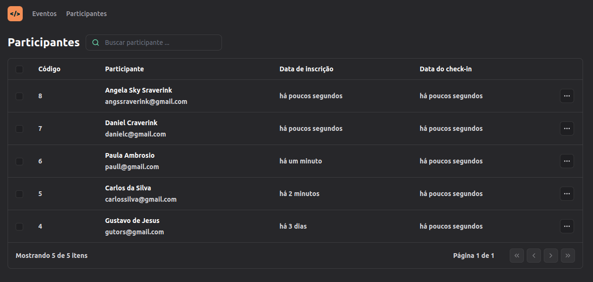

# nlw-pass-in-web-react

Pass-in is a project of events management. This application is the interface utilized by
the event organizer, where he can see all the events he has, and can also see all the attendees that are registered for each event.

## About the Tech Used

Application of the following concepts:

- Properties
- States (properties and URL)
- Components

We utilized typescript with React to make the interface responsive.
The app was developed utilizing Vite, a build tool that helps to accelerate build and testing.
For the style of the elements we utilized TailwindCSS, a library for CSS customization and Lucide-react for custom elements.

## Configuring develop environment

1) Clone the project (git clone <ssh or http>)
2) Install dependencies (npm, react, lucide-react, tailwindcss and vite)
3) Execute 'npm run dev' to start vite and application

** Check package.json for the dependencies versions **

## Deploying

To deploy the app, after installing all dependencies, just run 'npm run dev'

👉🏼[Click here to preview]
## (https://nlw-unite-15-pass-in.netlify.app/)

## About Me
I'm a Senior Software Developer in pursuit of a digital nomad career, looking to help other people achieve their goals through the usage of technology.

## Contact

